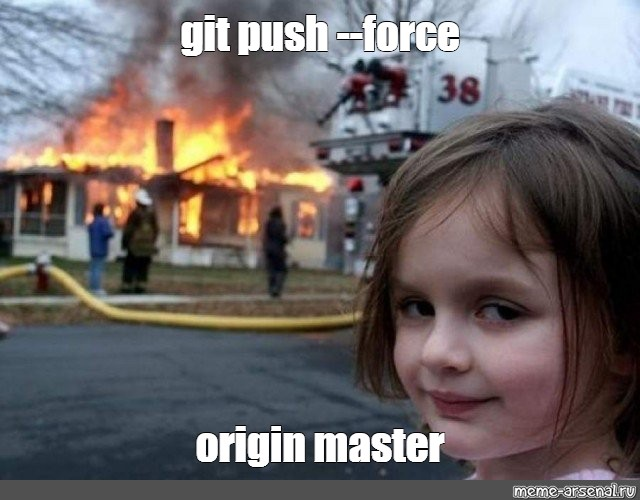

## Comandos GIT

Agora sim: a partir deste ponto aqui, deve ser o comandos GIT. Adicione abaixo todos os comandos utilizados para essa Trilha.

- git init
- git remote add origin
- git add
- git commit -m
- git push -u origin
- git checkout
- git checkout -b
- git pull origin

> Commit deixando apenas os comandos GIT, siga o desafio.

Ajuste o caminho dessa imagem também.

