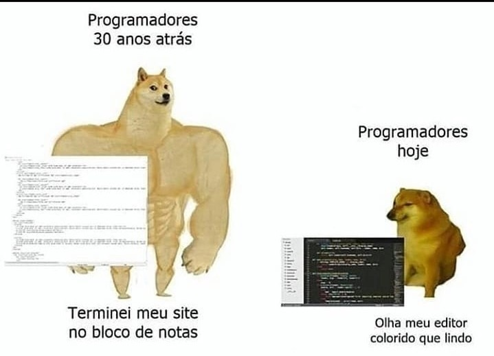

# Era uma vez um arquivo com conflitos

## E então meu PR quebrou

> Sim! Isso vai acontecer com alguma certa frequência. Comandos novos para gravar não são da noite para o dia. Por isso a arte de praticar, pratique muito até se tornar faceis.

### E como dito no desafio

Esse arquivo contém conflitos. Primeiro, ajuste o que está conflitando. Agora após correção, ajuste o caminho da imagem abaixo. Altere o nome da imagem para meme_programer

### Comandos GIT em treinamento

Seguindo no desafio, copie esse texto aqui dentro, e adicione em um novo arquivo. O nome do arquivo deve ser `resolver_conflitos.md`